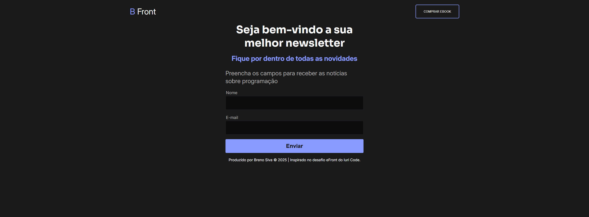

# 📬 Newsletter PetLife

[](https://newsletter-projeto-nine.vercel.app/)
[](https://github.com/Oberon-23/newsletter-projeto)

## ✨ Descrição

Este é um projeto de página de **newsletter responsiva** desenvolvido com foco em **boas práticas de HTML, CSS e JavaScript**, ideal para captar e-mails de usuários interessados em receber novidades e atualizações sobre a PetLife, uma clínica veterinária fictícia.

A aplicação simula um **formulário de inscrição simples**, com feedback visual e uma interface moderna, sendo totalmente funcional no front-end e ideal para integrar com ferramentas de automação de envio de e-mails como Mailchimp ou serviços SMTP.

---

## 💻 Tecnologias Utilizadas

- **HTML5** – Estrutura da página
- **CSS3** – Estilização e responsividade
- **JavaScript (Vanilla)** – Interatividade do formulário
- **Font Awesome** – Ícones
- **Google Fonts** – Tipografia
- **Vercel** – Hospedagem e deploy

---

## 🧩 Funcionalidades

- ✅ Layout responsivo para desktop e mobile
- ✅ Formulário de cadastro de e-mail
- ✅ Validação simples de entrada
- ✅ Mensagem de confirmação após envio
- ✅ Design limpo e moderno
- ✅ Pronto para integração com serviços de envio de newsletter

---

## 🔗 Link para acesso

- 🌐 **Deploy online**: [newsletter-projeto-nine.vercel.app](https://newsletter-projeto-nine.vercel.app/)
- 📁 **Repositório GitHub**: [github.com/Oberon-23/newsletter-projeto](https://github.com/Oberon-23/newsletter-projeto)

---

## 🛠️ Como utilizar este projeto

### 🔽 Clone o repositório:

```bash
git clone https://github.com/Oberon-23/newsletter-projeto.git

```

---

## ▶️ Abra o arquivo index.html no seu navegador ou utilize uma extensão como o Live Server (VS Code).

---

## 
📸 Preview



---

## 🧠 Aprendizados

Com esse projeto, pratiquei:

• Organização de estrutura HTML semântica

• Aplicação de responsividade usando flexbox

• Interações básicas com JavaScript

• Deploy de projetos estáticos na Vercel

• Experiência de usuário com mensagens de feedback

--- 

## 🙋‍♂️ Autor

Desenvolvido por Breno Silva
Front-end Developer | Projeto para fins de estudo

---

## 📃 Licença

Se quiser, posso te entregar esse conteúdo como arquivo `.md` pronto para colar no seu repositório.

Deseja que eu gere isso como um arquivo ou quer que eu inclua algum print da interface no `README` também?